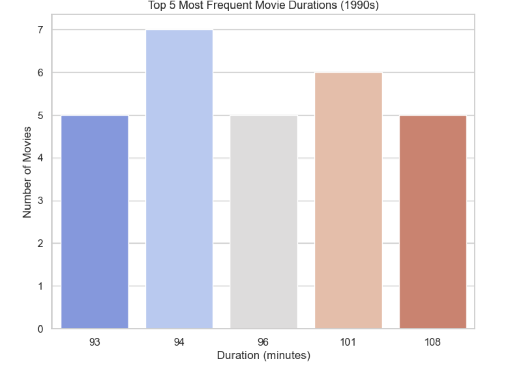
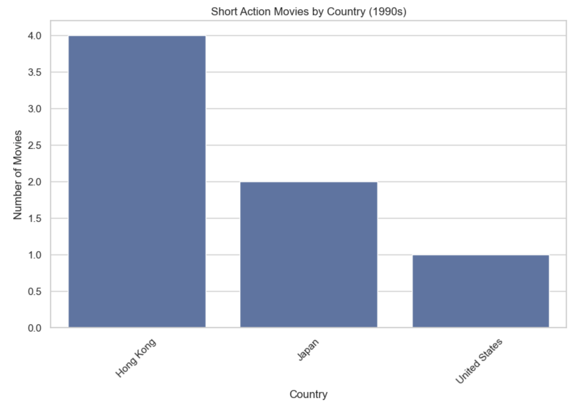

# Netflix-Movie-Analysis-1990s
By James Weaver

# Introduction
This project investigates movies released in the 1990s on Netflix, with a focus on movie durations, short action films, and production trends by country. Leveraging Python's pandas, matplotlib, and seaborn libraries, the analysis explores the golden decade of movies while providing actionable insights for entertainment professionals.

# Files
1. netflix_90s_analysis.ipynb:
The main Jupyter Notebook with detailed code for data filtering, analysis, and visualizations.
2. netflix_data.csv:
The dataset containing Netflix movie metadata, including titles, genres, durations, and release years.
3. netflix_90s_movies.csv:
Filtered dataset containing movies released between 1990 and 1999.
4. README.md:
Project overview, methodology, and key findings.

# Analysis
- Filtered Netflix movies released between 1990 and 1999.
- Analyzed the most frequent movie durations in the 1990s.
- Identified short action movies (less than 90 minutes) and their production countries.
- Visualized key insights using bar plots and country distributions.

# Key Findings
- The most frequent movie duration in the 1990s was 94 minutes.
- There were 27 short action movies produced in the decade, primarily from the United States and Hong Kong.
- Movies from this decade exhibit a strong focus on entertainment with concise, engaging runtimes.

# Visuals
Top 5 Movie Durations in the 1990s

Short Action Movies by Country

# Tools Used
- Python: Data analysis and visualization.
- Pandas: Data cleaning and manipulation.
- Matplotlib & Seaborn: Visualizations.
- Jupyter Notebook: Interactive coding environment.

# Future Improvements
- Analyze the evolution of movie genres across decades.
- Explore the most common directors or actors from the 1990s.
- Compare movie durations with modern movies (post-2010).
